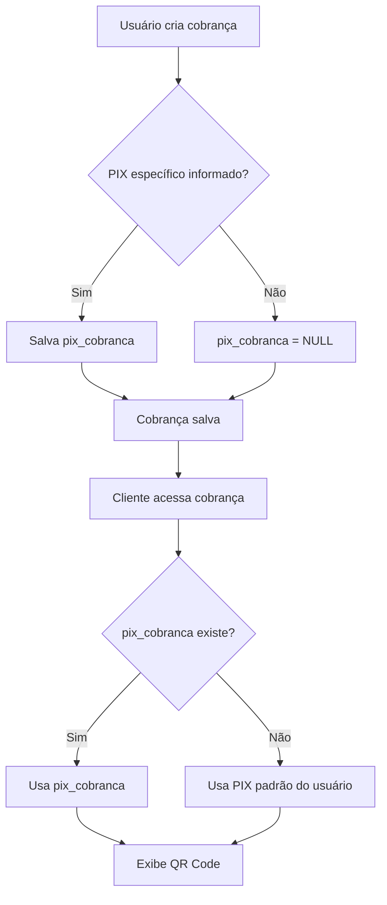

# Sistema de Configurações de Perfil e PIX

## Visão Geral

Este documento descreve o sistema de configurações de perfil e gestão de chaves PIX implementado no CoéPay.

## Funcionalidades

### 1. Configurações de Perfil

Os usuários podem atualizar suas informações pessoais através da página `/configuracoes`:

- **Nome**: Nome completo do usuário
- **E-mail**: E-mail de contato
- **Chave PIX Padrão**: Chave PIX que será usada em todas as cobranças futuras por padrão

### 2. Sistema de PIX Hierárquico

O sistema funciona com dois níveis de PIX:

#### PIX Padrão (Usuário)
- Armazenado na tabela `users`
- Usado como padrão para todas as cobranças
- Pode ser alterado na página de Configurações
- Alterações afetam apenas cobranças **futuras**

#### PIX Específico (Cobrança)
- Armazenado na coluna `pix_cobranca` da tabela `devedores`
- Opcional - usado apenas se especificado na criação da cobrança
- Permite usar um PIX diferente para uma cobrança específica
- Tem prioridade sobre o PIX padrão do usuário

### 3. Lógica de Resolução de PIX

Quando uma cobrança é visualizada, o sistema usa a seguinte ordem de prioridade:

```
1. Se `pix_cobranca` existe -> usa o PIX específico da cobrança
2. Se não -> usa o PIX padrão do usuário
```

## Banco de Dados

### Migration

Execute o arquivo `backend/migration_add_pix_cobranca.sql` para adicionar a coluna necessária:

```sql
ALTER TABLE devedores 
ADD COLUMN IF NOT EXISTS pix_cobranca TEXT;
```

### Estrutura

**Tabela `users`**:
- `pix` (TEXT): Chave PIX padrão do usuário

**Tabela `devedores`**:
- `pix_cobranca` (TEXT, NULLABLE): Chave PIX específica para esta cobrança

## Endpoints da API

### Atualizar Dados do Usuário

```
PUT /users/:id
Content-Type: application/json

{
  "name": "Nome do Usuário",
  "email": "email@exemplo.com",
  "pix": "sua-chave-pix"
}
```

**Resposta de Sucesso (200)**:
```json
{
  "id": 1,
  "name": "Nome do Usuário",
  "email": "email@exemplo.com",
  "pix": "sua-chave-pix"
}
```

### Criar Cobrança com PIX Específico

```
POST /devedores
Content-Type: application/json

{
  "user_id": 1,
  "nome": "Nome do Devedor",
  "valor": 100.00,
  "data_vencimento": "2025-12-31",
  "pix_cobranca": "pix-especifico-desta-cobranca" // OPCIONAL
}
```

## Interface do Usuário

### Página de Configurações (`/configuracoes`)

- Formulário com campos para Nome, E-mail e PIX
- Botão "Salvar Alterações"
- Mensagem informativa sobre o impacto das alterações
- Botão "Voltar ao Dashboard"

### Formulário de Nova Cobrança

- Campo "Chave PIX para esta cobrança (opcional)"
- Placeholder mostra o PIX padrão do usuário
- Mensagem explicativa sobre quando usar PIX específico

### Dashboard Header

- Novo botão "Configurações" com ícone de engrenagem
- Redireciona para `/configuracoes`

## Casos de Uso

### Caso 1: Usuário com um único PIX

**Cenário**: João tem apenas uma chave PIX e quer usar em todas as cobranças.

**Solução**:
1. João acessa Configurações
2. Define seu PIX padrão
3. Cria cobranças sem preencher o campo "PIX específico"
4. Todas as cobranças usarão seu PIX padrão

### Caso 2: Usuário com múltiplos PIX

**Cenário**: Maria tem PIX pessoal e empresarial.

**Solução**:
1. Maria define PIX pessoal como padrão nas Configurações
2. Ao criar cobrança empresarial, preenche o campo "PIX específico" com PIX empresarial
3. Cobrança empresarial usa PIX específico
4. Demais cobranças usam PIX pessoal (padrão)

### Caso 3: Mudança de PIX Padrão

**Cenário**: Pedro mudou de banco e tem novo PIX.

**Solução**:
1. Pedro acessa Configurações
2. Atualiza seu PIX padrão
3. **Cobranças antigas continuam com PIX antigo** (se foi especificado)
4. **Novas cobranças usam o novo PIX** automaticamente

## Observações Importantes

⚠️ **Atenção**:
- Alterações no PIX padrão NÃO afetam cobranças já criadas
- Cobranças antigas mantêm o PIX que foi usado na criação
- Para mudar PIX de cobrança existente, seria necessário criar nova cobrança

✅ **Boas Práticas**:
- Use PIX padrão para a maioria dos casos
- Use PIX específico apenas quando realmente necessário
- Documente internamente qual PIX está sendo usado para qual finalidade

## Fluxo de Dados



## Testes Recomendados

1. **Teste 1**: Criar cobrança sem PIX específico
   - Verificar se usa PIX padrão do usuário
   
2. **Teste 2**: Criar cobrança com PIX específico
   - Verificar se usa o PIX específico informado
   
3. **Teste 3**: Alterar PIX padrão nas configurações
   - Verificar se cobranças novas usam novo PIX
   - Verificar se cobranças antigas mantêm PIX original
   
4. **Teste 4**: Atualizar nome e e-mail
   - Verificar se dados são salvos corretamente
   - Verificar se localStorage é atualizado
